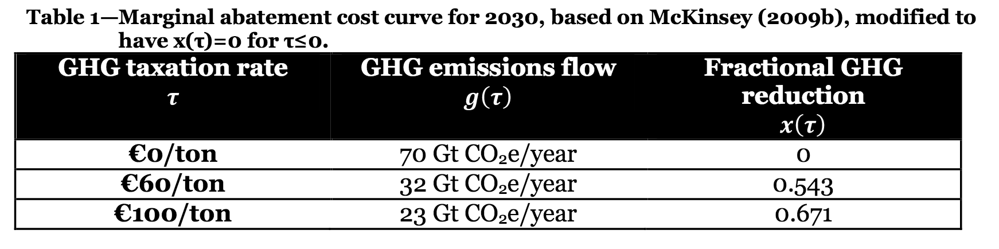

====
Cost
====

Calibrating the economic cost side of EZ-Climate requires specifying a relationship between the marginal cost of emissions reductions or per-ton tax rate, :math:`\tau`, the resulting flow of emissions in gigatonnes of :math:`CO_2`-equivalent emissions per year (Gt :math:`CO_2`), :math:`g(\tau)`, and the fraction of emissions reduced, :math:`x(\tau)`.

We calibrate :math:`\tau`, :math:`g(\tau)`, and :math:`x(\tau)` in EZ-Climate based on McKinsey’s global MACC effort (McKinsey_), with one crucial modification; we assume no mitigation (:math:`x(\tau)=0`) at :math:`\tau \le 0` i.e. no net-negative or zero-cost mitigation. Table 1 below shows the resulting calibration.

Fitting McKinsey’s modified point estimates (in $US) from Table 1 to a power function for :math:`x(\tau)` yields:

.. math::
	
	x(\tau) = 0.0923 \tau^{0.414}.

The corresponding inverse function, solving for the appropriate tax rate to achieve :math:`x` is:

.. math::
	
	\tau(x) = 314.32 x^{2.413}.

The above equation shows the marginal cost of abatement. Ultimately, we are interested in the total cost to society, :math:`\kappa(x)`, for each particular fractional-mitigation :math:`x`. We calculate using the envelope theorem and get the following equation:

.. math::
	
	\kappa(x) = \left(\frac{92.08 g_0}{c_0}\right) x^{3.413},

where :math:`g_0=52` Gt :math:`CO_2` represents the current level of global annual emissions, and :math:`c_0=$31` trilling/year in current (2015) global consumption. The equation for :math:`\kappa(x)` expresses the societal cost of a given level of mitigation as a percentage of consumption. We assume that, absent technological change, the function is time invariant. 

We also allow for backstop technology and technological changes. For discussion and derivation of these parameters, see paper_. At the end, we have the following cost function:

.. math::
	
	\kappa_t(x) = \kappa(x) \left( 1-\phi_0 - \phi_1 X_t \right)

where :math:`\phi_0` is a constant component, and :math:`\phi_1 X_t` a component linked to mitigation efforts  to date (where :math:`X_t` is the average mitigation up to time :math:`t`). See :mod:`ezclimate.cost` for more details.  

.. _McKinsey: http://www.mckinsey.com/business-functions/sustainability-and-resource-productivity/our-insights/pathways-to-a-low-carbon-economy
.. _paper: http://www.nber.org/papers/w22795