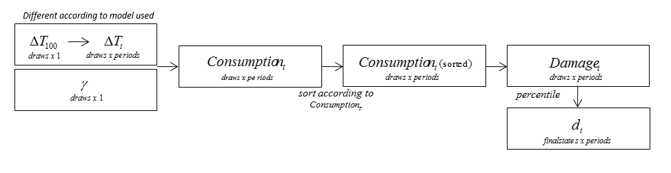

=================
Damage Simulation
=================

To simulate the distribution of damages, :math:`D_t`, the class :class:`ezclimate.damage_simulation.DamageSimulation` is used. The following picture demonstrate the work flow of the simulation process.

------------------
Temperature Change
------------------

Firstly, temperature change over the next 100 years is simulated for given maximum level of GHG. We use assumptions akin to Pindyck_ to fit a displaced gamma distribution around final GHG concentrations, while setting levels of GHG 100 years in the future equal to equilibrium levels. Parameters for these distribution can be found in the paper_. The time path for the temperature change at time :math:`t` (in years) is interpolate using function:

.. _Pindyck: http://web.mit.edu/rpindyck/www/Papers/UncertainOutcomesJEEM2012.pdf
.. _paper: http://www.nber.org/papers/w22795

.. math::

    \Delta T(t) = 2 \Delta T_{100}(1 - 0.5^{\frac{t}{100}}).

------------------
Map to Damage 
------------------

The next step is to translate average global surface warming into global mean economic losses via the damage function :math:`D_t`. There are two components to :math:`D_t`: a non-catastrophic and a catastrophic one.

The non-catastrophic component is comprised by a loss function of the form:

.. math::

    L(\Delta T(t)) = e^{-13.97 \gamma \Delta T(t)^2}

where :math:`\gamma` is drawn from a displaced gamma distribution. Based on non-catastrophic damages, consumption at any time :math:`t` is reduced as follows:

.. math::

    CD_t = \bar c_t  L(\Delta T(t)).

Then we need to calibrate the consumption reduction by adding tipping point which is related to catastrophic damge. Based on our assumption, there is a probability that a tipping point will be hit in each period and for each state, given :math:`Delta T(t)` and peakT above which we can expect to have hit a climatic tipping point. 

.. math::

    Prob(TP) = {1 - \left(1 - \left(\frac{\Delta T(t)}{max(\Delta T(t), peakT)}\right)^2\right)^{\frac{period}{30}}}.

Conditional on hitting a tipping point at time, the level of consumption reduction for each period :math:`t` is then at a level of:

.. math::

    CDTP_t = CD_t e^{TP\_damage} = \bar c_t L(\Delta T(t)) e^{-TP\_damage}.

----------------------
Calculate Damage Table
----------------------

We order the scenarios based on :math:`D_T`, the damage to consumption in the final period. We then choose states of nature with specified probabilities to represent different percentiles of this distribution. For example, if the first state of nature is the worst 1% of outcomes, then we assume the damage coefficient at time :math:`t` for the given level of mitigation is the average damage at time :math:`t` for the worst 1% of values for.

