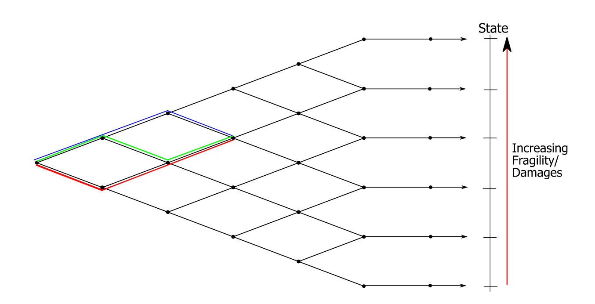

====
Tree
====

The :class:`ezclimate.tree.TreeModel` provides the structure for a non-recombining tree but does not store the actual values for the nodes in the tree. The tree can therefore be stored in a 1D-array and nodes, periods and states can be reached using the methods in :class:`ezclimate.tree.TreeModel`. The last period will have no brachning, and hence the same number of nodes as the previous period. See :mod:`~ezclimate.tree` module for more details.

